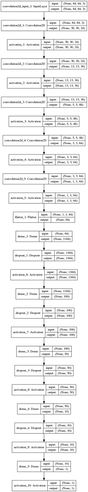

# keras-resnet-sdc
This repository was originally home to a Keras-based implementation of Resnet, adapted for use with Self-Driving Car data. The resnet architecture proved not so useful for the problem at hand (and lesson learned about naming a repo after the implementation)

After finding that resnet was not very useful, I turned to the Nvidia architecture referred to in the "End-to-End" paper mention in the Udacity course material. Initially this model only partially worked (it wouldn't produce sufficient results to get the car in the simulator past the bridge on Track 1). Two primary reasons for this were 1.) the lack of any sort of data augmentation to remove zero-centered data and 2.) the size of the input images. Some of the pre- and post-processed images are shown here for Track 2. As mentioned previously, zero-centered data is prunned from the dataset. Remaining data is subject to random flips (flipping steering angle as well), added shadowing of a random part of the image, translation, and changes in brightness. In addition to this type of augmentation, all camera feeds are used (with corrections to steering angle made based on whether it is a center, left, or right image, respectively.

 
 
 

After reading and incorporating some basic data augmentation and utilizing 64x64 images, instead of the 1/2 scaled image I had been using before (320x160, down to 160x80) the model was able to drive all of Track 1, no problem. The number of parameters in the model was brought down to a more reasonable level (~300,000). A visualization of the architecture is shown below.

 

This model included 5 convolutional layers and 4 fully connected layers. With a 64x64 image fed in, this network had ~300,000 parameters total. I did experiment with other existing architectures (comma ai, vgg, inception, xception), but none came close to the performance of the nvidia architecture. The only shortcoming of the model I trained was that it couldn't quite perform on Track 2. 
